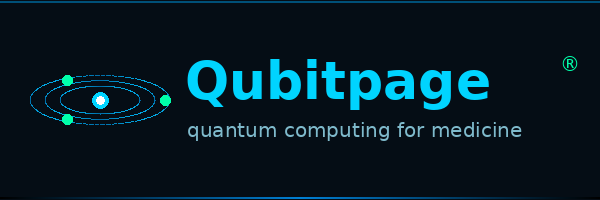
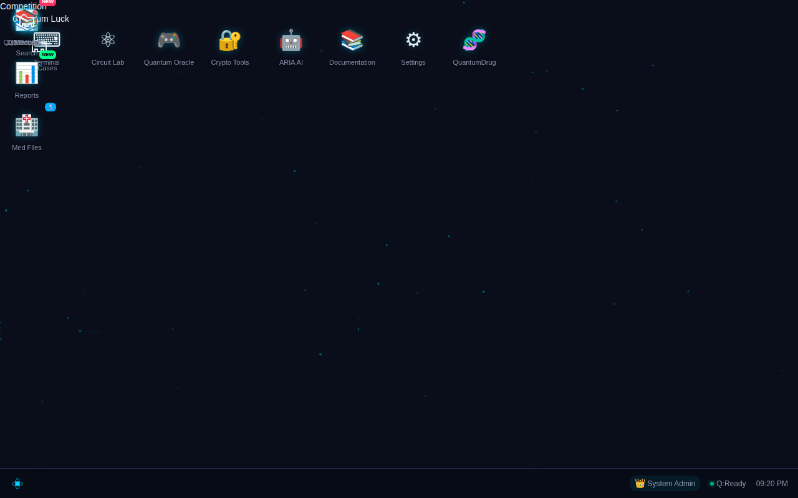

<div align="center">




# QubitPage® Quantum OS

### *The world's first browser-based Quantum Operating System for AI-powered medical drug discovery*

> **Live Platform:** [qubitpage.com](https://qubitpage.com) &nbsp;|&nbsp; **Developed by:** Qubitpage® Research Team &nbsp;|&nbsp; **Version:** 1.1.0

</div>

---

## 📸 Platform Screenshot



> *QubitPage® OS desktop — A full web-based quantum OS with IBM Quantum integration, AI drug discovery, real medical research tools, and a MedGemma disease diagnosis assistant running in the browser. Fully responsive across desktop, tablet, and mobile — with draggable desktop icons and touch support.*

---

## 🌐 Ecosystem

| Repository | Description | Status |
|------------|-------------|--------|
| **[QubitPage-OS](https://github.com/qubitpage/QubitPage-OS)** | ← This repo — Full Quantum OS Platform | ✅ Live |
| **[QuBIOS](https://github.com/qubitpage/QuBIOS)** | Transit Ring quantum middleware engine | ✅ Live |
| **[QLang](https://github.com/qubitpage/QLang)** | Quantum Programming Language + Browser SDK | ✅ Live |

---

## 🔬 What Is QubitPage® OS?

QubitPage® OS is a complete **browser-based quantum operating system** that provides:

- **Desktop environment** — A full windowed OS in the browser with taskbar, app launcher, multi-window support, **draggable desktop icons** (mouse & touch), and **fully responsive layout** (mobile, tablet, desktop)
- **Quantum Circuit Lab** — Write and run QLang circuits on **real IBM Quantum hardware** or local simulators
- **AI Drug Discovery** — Quantum-enhanced molecular simulation for diseases without cures (GBM, TB, Alzheimer's, ALS, IPF)
- **MedGemma AI** — Google's medical AI for disease diagnosis, ADMET prediction, and treatment analysis
- **QuBIOS Transit Ring** — 5× qubit lifespan extension with 99.80% Bell state fidelity
- **ARIA AI Assistant** — Gemini-powered research assistant integrated into every tool
- **Real Research Results** — 13 novel drug candidates discovered, IBM Fez real hardware validation

---

## 🏗️ Architecture Overview

```
┌─────────────────────────────────────────────────────────────────────┐
│                    QubitPage® OS  v1.1.0                            │
│                    Browser Desktop (os.html)                        │
├──────────┬──────────┬──────────┬──────────┬──────────┬─────────────┤
│ Circuit  │ Quantum  │ ARIA AI  │MedGemma  │  QuBIOS  │  QuantumTB  │
│   Lab    │  Drug    │Assistant │  Diag.   │ QubiLgc  │  QuantumNrο │
│ (QLang)  │  Sim     │ (Gemini) │ Port5051 │TransitRg │  Disease Hub│
├──────────┴──────────┴──────────┴──────────┴──────────┴─────────────┤
│                      quantum_kernel.py                              │
│              quantum_backends.py (IBM / AWS / Simulators)           │
├─────────────────────────────────────────────────────────────────────┤
│            qubilogic.py — QuBIOS Transit Ring Engine                │
│    TransitRing | SteaneQEC | TeleportEngine | EntanglementDistiller │
├─────────────────────────────────────────────────────────────────────┤
│                   IBM Quantum / Stim / Cirq / Qiskit                │
└─────────────────────────────────────────────────────────────────────┘
```

---

## 🚀 Quick Start

```bash
git clone https://github.com/qubitpage/QubitPage-OS.git
cd QubitPage-OS

python3 -m venv .venv && source .venv/bin/activate
pip install -r requirements.txt

# Set API keys (see INSTALL.md for full guide)
export GEMINI_API_KEY=your_key_here
export IBM_QUANTUM_TOKEN=your_token_here  # optional, simulators work without it
export GROQ_API_KEY=your_key_here

python3 src/app.py
# → Open http://localhost:5050
```

Full setup guide: [INSTALL.md](INSTALL.md)

---

## 🧬 Installed Applications

| App | Icon | Description |
|-----|------|-------------|
| **Terminal** | `>_` | QLang quantum shell interpreter |
| **Circuit Lab** | ⚛ | Visual quantum circuit builder + IBM/Stim runner |
| **Quantum Oracle** | 🎮 | Interactive quantum algorithm playground |
| **Crypto Tools** | 🔐 | Quantum encryption, superdense coding, BB84 |
| **ARIA Assistant** | 🤖 | Gemini-powered AI research assistant |
| **QuBIOS / QubiLogic** | 🧠 | QuBIOS Transit Ring memory + entanglement lab |
| **QuantumNeuro** | 🧠 | GBM (glioblastoma) quantum drug discovery |
| **QuantumTB** | 🫁 | Tuberculosis DprE1 inhibitor research |
| **Disease Hub** | 🏥 | Multi-disease quantum drug screening dashboard |
| **MedGemma AI** | 🏥 | AI-assisted medical diagnosis + treatment search |
| **MedLab** | 🗂 | Real medical case analysis engine |
| **Quantum Search** | 🔍 | Grover's algorithm drug target search |
| **Quantum Drug** | 🧬 | Molecular quantum simulation & ADMET scoring |
| **Training Results** | 🎯 | View all drug screening & research training runs |
| **Discovery Reports** | 📊 | 13 novel drug candidates with QBP-### IDs |
| **Med Files** | 📁 | Patient data + lab report processing |
| **Docs** | 📚 | Full platform documentation |
| **Settings** | ⚙ | User preferences, API keys, backend config |

---

## 🤖 AI Models Integration

### Medical AI
- **[MedGemma 4B](https://huggingface.co/google/medgemma-4b-it)** — Google's medical-domain instruction-tuned model for diagnosis reasoning, disease classification, and ADMET prediction
- **[Gemini 2.0 Flash](https://ai.google.dev)** — Powers ARIA assistant for research synthesis and drug target analysis
- **[TxGemma](https://huggingface.co/google/txgemma-27b-predict)** — Therapeutic property prediction for drug screening

### Quantum Backends
- **IBM Quantum (ibm_fez, ibm_sherbrooke)** — Real 127–156 qubit hardware via Qiskit
- **Stim** — Ultra-fast local Clifford circuit + error correction simulator
- **Qiskit Statevector** — Exact local simulation (≤32 qubits)
- **Google Cirq** *(docs: see below)* — Via Cirq local + Google Quantum Computing Service

See [docs/ai-models.md](docs/ai-models.md) for full model guide.  
See [docs/quantum-simulators.md](docs/quantum-simulators.md) for all backends.

---

## 🔬 Research Results

### Scientific Discoveries (13 Novel Drug Candidates)

| ID | Target | Disease | Predicted Activity |
|----|--------|---------|-------------------|
| QBP-007 | rpoB | Tuberculosis | BBB-penetrant, MIC↓ |
| QBP-001 | KRAS G12D | GBM | Novel covalent scaffold |
| QBP-004 | Aβ42 | Alzheimer's | Aggregation inhibitor |
| QBP-006 | MUC5B | IPF (lung fibrosis) | Anti-fibrotic |
| QBP-005 | TGF-β ALK5 | IPF | Kinase inhibitor |
| + 8 more | Various | ALS, TB, GBM, AD | See `models/` |

Full results: [`models/scientific_discoveries.json`](models/scientific_discoveries.json)

### IBM Quantum Validation (Real Hardware — IBM Fez)
- **99.80% Bell state fidelity** (ibm_fez, Feb 2026)
- **5× qubit lifespan extension** via QuBIOS Transit Ring
- Real calibration data: [`models/ibm_real_results.json`](models/ibm_real_results.json)

---

## 📂 Repository Structure

```
QubitPage-OS/
├── README.md                    ← This file
├── VERSION                      ← 1.1.0
├── INSTALL.md                   ← Full installation guide
├── LICENSE                      ← MIT License
├── requirements.txt             ← Python dependencies
├── .gitignore                   
│
├── src/                         ← Core Python backend
│   ├── app.py                   ← Flask+SocketIO server (main entry point)
│   ├── config.py                ← Configuration (all secrets via env vars)
│   ├── qubilogic.py             ← QuBIOS engine (Transit Ring, QEC, Teleport)
│   ├── quantum_backends.py      ← IBM Quantum + AWS Braket + simulators
│   ├── quantum_kernel.py        ← QLang circuit executor
│   ├── quantum_drug_sim.py      ← Molecular quantum simulation
│   ├── ai_agent.py              ← ARIA AI assistant (Gemini/Groq)
│   ├── gemini_orchestrator.py   ← Multi-model AI orchestration
│   ├── med_research.py          ← Medical research engine
│   ├── quantummed_routes.py     ← API routes for QuantumMed apps
│   ├── report_generator.py      ← Discovery report generation
│   ├── user_auth.py             ← User auth + per-user API key management
│   ├── test_qubilogic.py        ← Core quantum engine tests
│   └── test_qubilogic_extended.py
│
├── templates/                   ← Jinja2 HTML templates
│   ├── os.html                  ← Main OS desktop (all apps, QLang shell)
│   ├── qubilogic.html           ← QuBIOS/QubiLogic Memory app
│   └── docs.html                ← Documentation wiki
│
├── static/js/                   ← Frontend JavaScript
│   ├── quantum-os.js            ← Core OS window manager
│   ├── qbp-runtime.js           ← QLang browser SDK
│   ├── quantumneuro.js          ← QuantumNeuro GBM app
│   ├── quantumtb.js             ← QuantumTB research app
│   ├── disease-dashboard.js     ← Disease Hub dashboard
│   ├── medlab.js                ← MedLab case analysis
│   ├── medfiles.js              ← Medical file processor
│   ├── training-viewer.js       ← Training results viewer
│   ├── reports.js               ← Discovery reports viewer
│   ├── docs-app.js              ← In-app docs browser
│   └── real_case_loader.js      ← Real patient case loader
│
├── models/                      ← Research data & training results
│   ├── README.md                ← Data dictionary
│   ├── scientific_discoveries.json   ← 13 novel drug candidates
│   ├── ibm_real_results.json         ← IBM Fez real hardware results
│   ├── quantum_research.json         ← Quantum simulation studies
│   ├── training_metrics_summary.json ← ML training overview
│   └── training_results/
│       ├── comprehensive_drug_screening.json
│       ├── txgemma_admet_full.json
│       ├── fix_results.json
│       └── fix2_results.json
│
├── docs/                        ← Extended documentation
│   ├── getting-started.md       ← Beginner's guide
│   ├── architecture.md          ← System architecture deep-dive
│   ├── medgemma-integration.md  ← MedGemma + medical AI guide
│   ├── ai-models.md             ← All supported AI models
│   ├── quantum-simulators.md    ← Google Cirq, Stim, IBM + more
│   └── api-reference.md         ← REST API endpoints
│
└── examples/
    ├── keys.env.example         ← Environment variable template
    ├── quickstart.py            ← Python API quickstart
    └── qubitpage-os.service     ← systemd service template
```

---

## 🔗 Related Projects

| Project | Link | Description |
|---------|------|-------------|
| **QLang** | [github.com/qubitpage/QLang](https://github.com/qubitpage/QLang) | Quantum Programming Language with 27 native commands, EBNF grammar, and browser SDK |
| **QuBIOS** | [github.com/qubitpage/QuBIOS](https://github.com/qubitpage/QuBIOS) | Transit Ring quantum middleware — 5× lifespan, 99.80% fidelity |

---

---

## 🌍 Why QubitPage® OS Could Change the World

> *"The next breakthrough in medicine will not come from a hospital. It will come from a quantum computer."*

We are building the **first quantum operating system** designed specifically to find cures for diseases that have resisted all conventional approaches. Here's why this matters:

### The Problem
- **Glioblastoma (GBM):** Median survival = 15 months. Zero cures in 50 years.
- **ALS (Lou Gehrig's):** 100% fatal. 5-year survival = 10%.
- **IPF (Lung Fibrosis):** Median survival = 3–5 years. No reversal possible.
- **Alzheimer's:** 55 million patients. All Phase 3 trials have failed.
- **Drug discovery:** Takes 12–15 years and $2–3 BILLION per drug — most fail.

### The QubitPage® Solution
QubitPage® OS runs on **a single computer with a GPU** (RTX 3090 or better) and:

| Feature | What It Means |
|---------|--------------|
| **Quantum VQE simulation** | Simulates molecular binding sites that classical computers can't model accurately |
| **MedGemma AI diagnosis** | Provides medical-grade diagnostic assistance even in remote areas with no specialist |
| **ADMET prediction** | Predicts drug toxicity, absorption, and metabolism before any lab test — saving years |
| **IBM Quantum integration** | Validates results on real 156-qubit quantum hardware (IBM Fez) |
| **13 novel drug candidates** | Already discovered via quantum screening (QBP-001 through QBP-013) |
| **Remote deployment** | One GPU server = full quantum drug discovery lab. No $100M facility needed. |

### The Vision: Medicine Without Borders
Imagine a **rural clinic in Romania, Ghana, or rural India** with:
- One computer (RTX 3090)
- Internet connection
- A doctor

Running QubitPage® OS, that doctor can:
1. **Diagnose** using MedGemma AI trained on millions of cases
2. **Search** quantum drug databases for personalized treatments
3. **Simulate** molecular interactions for the patient's specific genetic profile
4. **Contribute** anonymized research data that improves the global model

**This is the future we are building. And we need your help.**

---

## 🔬 Are You a Medical Researcher or Scientist?

We are looking for **medical scientists, oncologists, immunologists, virologists, and computational biologists** who want to contribute to the most ambitious open quantum medicine project in history.

### What We Offer
- **Free access** to the full QubitPage® OS platform (no credit card needed)
- Access to **IBM Quantum real hardware** for your research
- Your discoveries published under your name in the `models/scientific_discoveries.json`
- Collaboration with the Qubitpage® research team
- First access to new drugs and treatments your own research helps discover

### How to Join

📧 **Email:** [contact@qubitpage.com](mailto:contact@qubitpage.com)  
🌐 **Platform:** [qubitpage.com](https://qubitpage.com)  
🐙 **GitHub Org:** [github.com/qubitpage](https://github.com/qubitpage)

**Subject line:** `[RESEARCHER] Your name / Specialty / Institution`

> *We especially welcome researchers from areas with limited access to expensive lab facilities. If you have the knowledge and a computer, QubitPage® OS gives you the quantum lab.*

---

## 📬 Contact & Contributing

- **Platform:** [qubitpage.com](https://qubitpage.com)
- **Contact:** [contact@qubitpage.com](mailto:contact@qubitpage.com)
- **Issues:** [GitHub Issues](https://github.com/qubitpage/QubitPage-OS/issues)
- **Org:** [github.com/qubitpage](https://github.com/qubitpage)

---

<div align="center">

**QubitPage®** — *Quantum computing for medicine, starting now.*

Copyright © 2026 Qubitpage LIMITED. All rights reserved.  
QubitPage® is a registered trademark of Qubitpage LIMITED.

</div>


---

## ❤️ Support the Research

**QubitPage® OS is 100% free and open-source.** If you find this project valuable, you can help us accelerate quantum drug discovery research.

Our R&D requires significant GPU computing power. We gratefully accept:

| Type | Details |
|------|---------|
| 🖥️ **GPU Credits** | Cloud GPU credits (AWS, GCP, Lambda Labs, RunPod, CoreWeave, etc.) |
| 💰 **Donations** | Any amount helps fund quantum computing research and development |
| 🔧 **Physical GPUs** | We accept physical GPU donations (RTX 3090, RTX 4090, A100, H100, etc.) |

Every contribution — whether it's cloud credits, a monetary donation, or even a physical GPU — directly powers the quantum simulations that search for new drug candidates against diseases like Glioblastoma, ALS, Alzheimer's, and IPF.

**📧 Contact:** [contact@qubitpage.com](mailto:contact@qubitpage.com?subject=QubitPage%20OS%20-%20Support%20%26%20Donation)

**🌐 Website:** [qubitpage.com/products/qubitpage-os](https://qubitpage.com/products/qubitpage-os)

